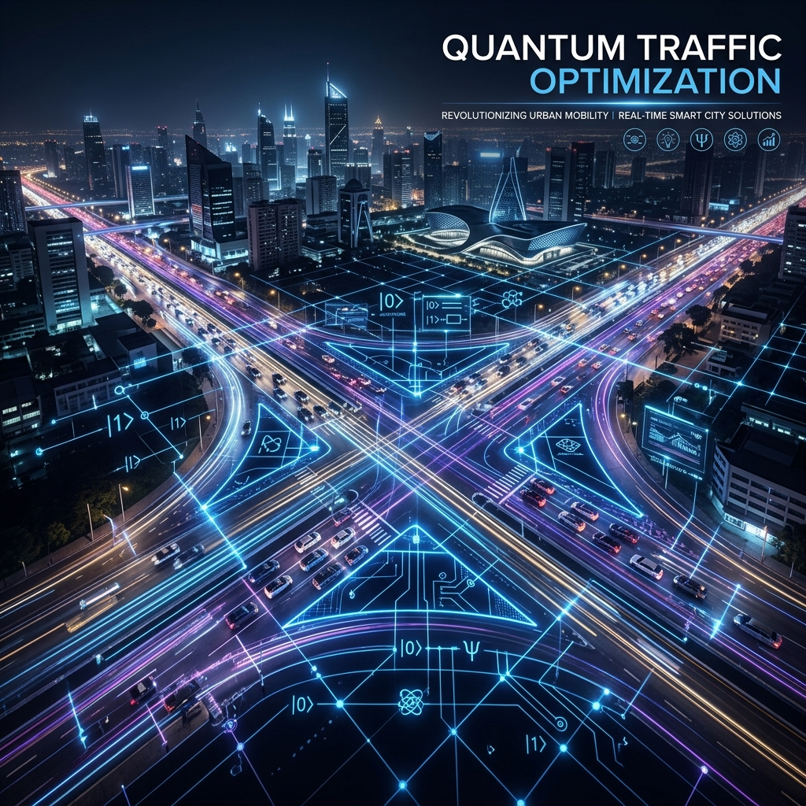
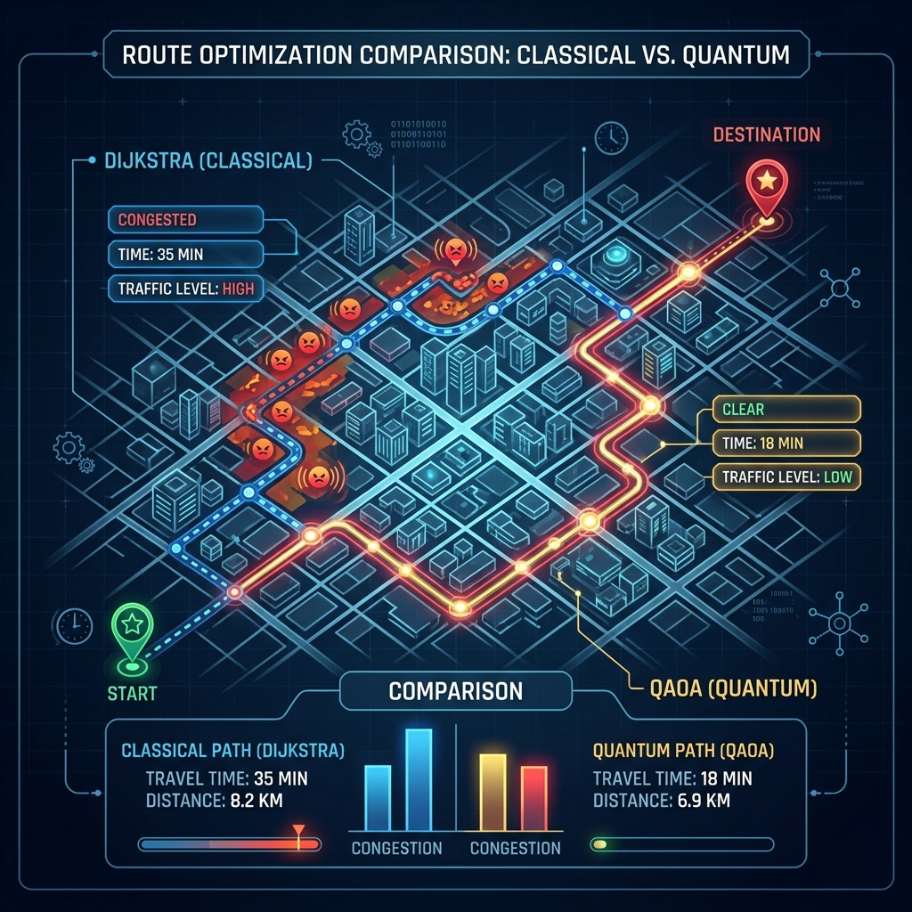
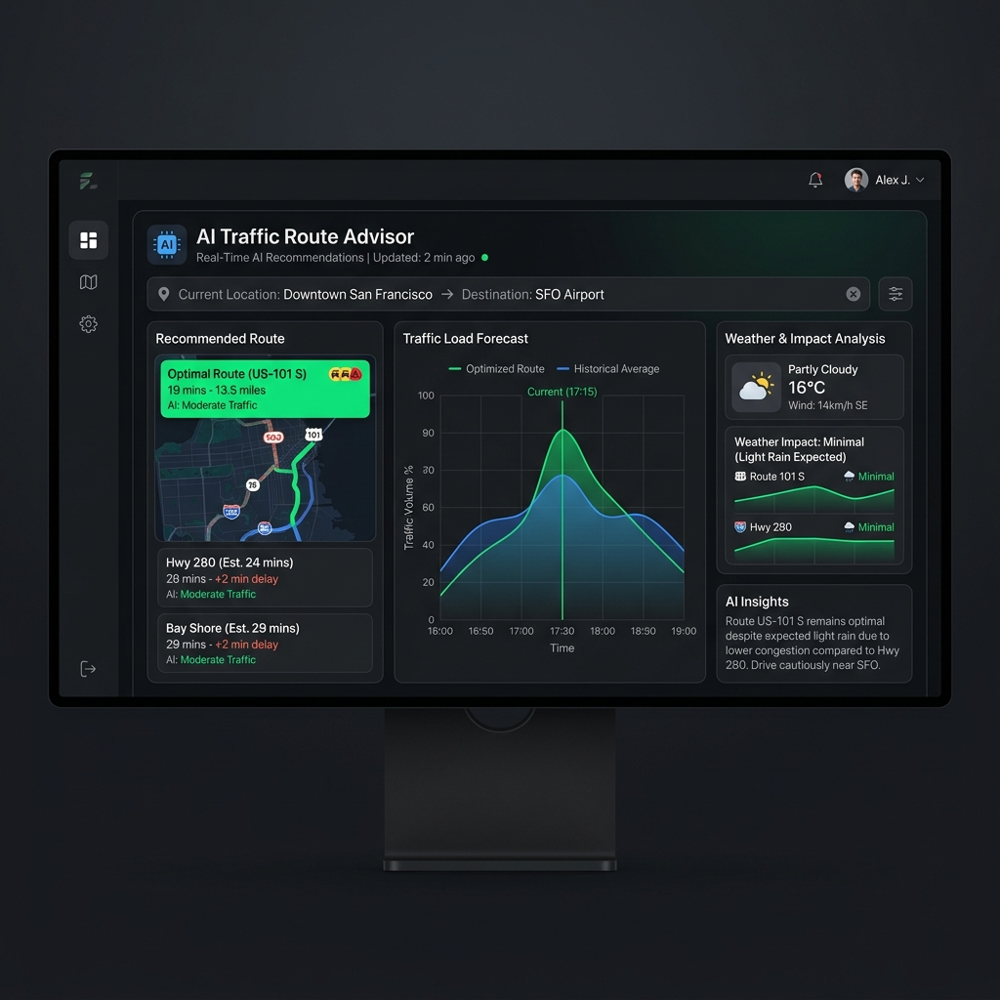
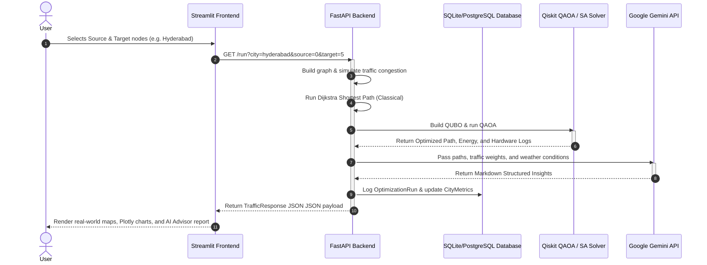

<p align="center">
  
</p>

# 🚦 Quantum Traffic Optimization System with GenAI Smart Advisor

> **QAOA-powered smart city traffic routing** with real-time data integration, multi-city support, reinforcement learning enhancements, and GenAI-driven conversational insights.

[](https://www.python.org/)
[](https://fastapi.tiangolo.com/)
[](https://qiskit.org/)
[](https://streamlit.io/)
[](https://www.docker.com/)
[](LICENSE)

---

## 🌟 Introduction

Urban traffic congestion is one of the most critical challenges facing modern smart cities, leading to billions of hours wasted and megatons of unnecessary carbon emissions. Classical routing algorithms (like Dijkstra's) compute routes greedily based on static or simple linear traffic edge weights, failing to capture complex, multi-vehicle congestion interactions and bottle-neck corridors.

The **Quantum Traffic Optimization System** resolves this by modeling urban routing as a **Quadratic Unconstrained Binary Optimization (QUBO)** problem. Solved using the **Quantum Approximate Optimization Algorithm (QAOA)** via IBM Qiskit, the system evaluates the superposition of all potential routes simultaneously, taking into account both individual travel time and quadratic interactions (bottlenecks caused by route overlapping). An **AI Smart Advisor** powered by Generative AI interprets the optimization outputs, translating high-dimensional quantum states and metrics into actionable natural language routing reports for transport managers.

---

## 🗺️ Visualizing the System

### 1. Classical Routing vs. Quantum Optimization
<p align="center">
  
</p>

* The **Dijkstra Path (Classical)** minimizes travel time greedily, routing traffic into heavy corridors when they appear slightly faster on an individual basis.
* The **QAOA Path (Quantum)** models traffic holistically. By penalizing consecutive high-traffic edges quadratic-wise (congestion interaction), it diverts routes to avoid systemic bottlenecks, achieving lower global network costs.

### 2. GenAI Smart Advisor Dashboard
<p align="center">
  
</p>

* Integrates real-time optimization logs, local weather forecasts, and historical run data.
* Explains the "why" behind the chosen quantum routes, translating execution times, carbon footprint reductions, and energy metrics into clear recommendations.

---

## 📂 Project Structure

The project has been organized following professional software engineering patterns:

```
quantum-traffic-optimization/
├── api/
│   └── main.py                      # FastAPI application backend and endpoints
├── config/
│   ├── settings.py                  # Global settings, thresholds, and variables
│   └── cities.py                    # Metadata, GPS coords, and networks of 6 cities
├── data/                            # Persistent SQLite database storage (local fallback)
├── docs/
│   ├── architecture.md              # Detailed technical design document
│   └── DEPLOYMENT.md                # Deployment playbook for staging and production
├── frontend/
│   └── app.py                       # Streamlit multi-tab user interface dashboard
├── logs/                            # Rotating log files
├── src/
│   ├── core/
│   │   ├── classical.py             # Dijkstra's shortest path implementation
│   │   ├── quantum_qaoa.py          # QUBO graph formulation, QAOA, & Simulated Annealing
│   │   └── genai.py                 # Generative AI client for report generation
│   ├── database/
│   │   ├── database.py              # DB engine and session handling
│   │   └── models.py                # SQL Alchemy ORM database schemas
│   ├── integrations/
│   │   └── traffic_api.py           # Google Maps, TomTom, and OpenWeather client wrappers
│   ├── simulation/
│   │   └── traffic_simulation.py    # Mock traffic graphs, congestion levels, & forecast metrics
│   ├── utils/
│   │   ├── logger.py                # Logging utility with file rotation
│   │   └── metrics.py               # Prometheus metrics metrics collector
│   └── visualization/
│       ├── map_viz.py               # Folium OSM mapping component
│       ├── chart_viz.py             # Plotly analytics charts
│       └── graph_viz.py             # NetworkX node-link structure visualizer
├── requirements.txt                 # Complete Python package dependencies
├── run.py                           # Convenient multi-process service launcher
└── streamlit_app.py                 # Single-port cloud deployment entry point (e.g. Streamlit Cloud)
```

---

## ⚛️ Algorithm Deep-Dive

### Classical Dijkstra Fallback
Given a directed graph $G = (V, E)$ with edge traffic weights $w_e$:
$$\text{Minimize} \sum_{e \in \text{Path}} w_e$$
This is solved using Dijkstra's algorithm in $O(E + V \log V)$ time. It cannot model quadratic dependencies.

### Quantum Formulation (QUBO)
We formulate the routing problem as a Quadratic Unconstrained Binary Optimization (QUBO) problem. For each candidate edge $e_i \in E$, we assign a binary variable $x_i \in \{0, 1\}$, where $x_i = 1$ indicates that edge $i$ is selected in the final route.

The composite Hamiltonian energy function $H(x)$ minimized by the solver is:
$$H(x) = H_{\text{cost}}(x) + H_{\text{congestion}}(x) + H_{\text{flow}}(x)$$

1. **Linear Traffic Cost ($H_{\text{cost}}$)**:
   Measures cumulative traffic weight, fuel consumption, and emission values along the path.
   $$H_{\text{cost}}(x) = \sum_{i} \left( \text{Traffic}_i + \text{Fuel}_i + \text{Emissions}_i \right) x_i$$

2. **Quadratic Congestion Interaction ($H_{\text{congestion}}$)**:
   Penalizes paths that utilize consecutive bottleneck edges, reflecting real-world congestion cascade effects:
   $$H_{\text{congestion}}(x) = K_{\text{congestion}} \sum_{i < j} \text{Traffic}_i \cdot \text{Traffic}_j \cdot x_i \cdot x_j$$
   where $K_{\text{congestion}}$ represents the interaction coefficient (default is `1.5`).

3. **Hard Flow-Conservation Constraint ($H_{\text{flow}}$)**:
   Ensures the selected edges form a single, continuous, valid path from the source node $S$ to target node $T$.
   $$H_{\text{flow}}(x) = \text{Penalty} \sum_{v \in V} \left( \sum_{e \in \delta^+(v)} x_e - \sum_{e \in \delta^-(v)} x_e - b_v \right)^2$$
   where:
   $$b_v = \begin{cases} 1 & \text{if } v = S \\ -1 & \text{if } v = T \\ 0 & \text{otherwise} \end{cases}$$
   $\delta^+(v)$ and $\delta^-(v)$ represent outgoing and incoming edges from node $v$, respectively. The default value for $\text{Penalty}$ is `200`.

### Quantum Solver & Simulation
The system maps this QUBO onto a parameterized quantum circuit using $N$ qubits (where $N$ is the number of active edges). The QAOA parameters ($\beta$, $\gamma$) are iteratively updated using a classical optimization loop (such as COBYLA) run over $p$ steps (default reps = 2). 

* **Hardware Support**: If `IBMQ_API_TOKEN` is found in the environment, the solver targets actual IBM Quantum physical backends (such as `ibm_brisbane`).
* **Simulator Fallback**: If no token is provided, the solver runs on the high-performance local `qiskit_aer` simulator.
* **Classical Pre-Verifier**: In-parallel, the solver runs a multi-restart **Simulated Annealing (SA)** solver on the QUBO to verify and cross-check the quantum circuit measurements.

---

## 🛠️ System Request Flow

The following diagram illustrates how user requests travel through the application layer to trigger classical routing, quantum optimization, database logging, and AI report generation:



---

## 🚀 Quick Start (Local Development)

### 📋 Prerequisites
* Python 3.11 or higher
* Pip or Virtualenv package manager
* Access to ports `8000` (FastAPI) and `8501` (Streamlit)

### 1. Clone & Set Up
```bash
# Clone the repository
git clone <repository-url>
cd quantum-traffic-optimization

# Create and activate virtual environment
python -m venv venv
source venv/bin/activate  # On Windows use: venv\Scripts\activate

# Install requirements
pip install -r requirements.txt
```

### 2. Configure Environment Variables
Create a `.env` file in the root directory (you can copy [.env.example](.env.example)):
```bash
# API Host Configuration
API_HOST=0.0.0.0
API_PORT=8000

# AI Advisor Configuration (Generate from Google AI Studio)
GEMINI_API_KEY=your_gemini_api_key_here

# External APIs (Optional - falls back to simulated data if omitted)
GOOGLE_MAPS_API_KEY=your_google_maps_key
TOMTOM_API_KEY=your_tomtom_api_key
OPENWEATHER_API_KEY=your_openweather_key

# IBM Quantum Credentials (Optional - falls back to local simulator if omitted)
IBMQ_API_TOKEN=your_ibm_quantum_token_here

# Optimization Parameters
QAOA_REPS=2
QAOA_MAX_ITER=50
```

### 3. Launch the Application
Run the one-click launcher script [run.py](run.py):
```bash
# Starts both FastAPI and Streamlit concurrently
python run.py
```

* **Start Backend Only**: `python run.py --api`
* **Start Frontend Only**: `python run.py --ui`
* **Run Test Suite**: `python run.py --test`

### 4. Access Interfaces
* **Interactive Dashboard**: [http://localhost:8501](http://localhost:8501)
* **REST API Server**: [http://localhost:8000](http://localhost:8000)
* **Swagger/OpenAPI Documentation**: [http://localhost:8000/docs](http://localhost:8000/docs)

---

## 📡 API Endpoints Reference

| Method | Endpoint | Query Parameters | Description |
| :--- | :--- | :--- | :--- |
| **GET** | `/` | None | Welcome message and list of endpoints. |
| **GET** | `/health` | None | API health status, version, and server time. |
| **GET** | `/cities` | None | Retrieve names and configuration models of all 6 supported cities. |
| **GET** | `/config` | `city` (string) | Retrieve graph layout, names, and latitude/longitude coordinates of intersections. |
| **GET** | `/run` | `city` (str), `source` (int), `target` (int), `use_real_traffic` (bool), `forecast` (bool) | Triggers Dijkstra vs. QAOA optimization. Returns comparison matrices, AI report text, and paths. |
| **GET** | `/history` | `city` (string, optional), `limit` (int) | Query past optimization results stored in the database. |
| **GET** | `/analytics/city/{city_id}` | `{city_id}` in path | Retrieve aggregate metrics (win rates, runtimes, counts) for a target city. |

---

## 🐳 Docker Deployment

The application features a fully dockerized multi-container architecture. The stack installs FastAPI, Streamlit, PostgreSQL, Redis, Prometheus, and Grafana.

```bash
# 1. Clone and construct .env
cp .env.example .env

# 2. Build and start services in background
docker-compose up -d --build

# 3. Verify container processes
docker-compose ps

# 4. Stream real-time logs
docker-compose logs -f
```

### Container Services Mapping:
* **API Service**: [http://localhost:8000](http://localhost:8000)
* **Dashboard Dashboard**: [http://localhost:8501](http://localhost:8501)
* **Prometheus Server**: [http://localhost:9090](http://localhost:9090)
* **Grafana Dashboard**: [http://localhost:3000](http://localhost:3000) (Default user/pass: `admin`/`admin`)

---

## ☁️ Cloud Deployment Playbook

For complete commands, JSON configurations, and architecture models, refer to [docs/DEPLOYMENT.md](docs/DEPLOYMENT.md).

### AWS ECS (Fargate) Deployment
Fargate allows serverless container execution.
```bash
# Push API container to ECR
aws ecr get-login-password --region us-east-1 | docker login --username AWS --password-stdin <aws-account-id>.dkr.ecr.us-east-1.amazonaws.com
docker build -t quantum-traffic-api .
docker tag quantum-traffic-api:latest <aws-account-id>.dkr.ecr.us-east-1.amazonaws.com/quantum-traffic-api:latest
docker push <aws-account-id>.dkr.ecr.us-east-1.amazonaws.com/quantum-traffic-api:latest

# Create ECS Service
aws ecs create-service --cluster quantum-traffic-cluster --service-name api-service --task-definition quantum-traffic-api --desired-count 2 --launch-type FARGATE --network-configuration "awsvpcConfiguration={subnets=[subnet-123],securityGroups=[sg-456],assignPublicIp=ENABLED}"
```

### GCP Cloud Run Deployment
For single-instance scale-to-zero serverless endpoints:
```bash
# Build & deploy
gcloud builds submit --tag gcr.io/<gcp-project-id>/quantum-traffic-api
gcloud run deploy quantum-traffic-api --image gcr.io/<gcp-project-id>/quantum-traffic-api --platform managed --region us-central1 --allow-unauthenticated
```

### Azure Container Instances (ACI)
For simple cloud testing:
```bash
az container create --resource-group quantum-traffic-rg --name quantum-traffic-api --image <registry-name>.azurecr.io/quantum-traffic-api:latest --dns-name-label quantum-traffic --ports 8000 8501 --environment-variables DATABASE_URL=postgresql://... REDIS_URL=redis://...
```

---

## 📈 Monitoring & Metrics

### Prometheus Metrics
The API exposes critical system parameters at `/metrics` for scraper scraping.
* `optimization_runs_total{city, algorithm}`: Count of optimization requests triggered.
* `optimization_duration_seconds{city}`: High-precision solver execution latency.
* `api_requests_total{method, status}`: Total API HTTP requests handled.

### Grafana Dashboards
Connect your Grafana instance to the Prometheus data source (`http://prometheus:9090`) to monitor:
1. Average quantum solver computation speed versus Dijkstra path generation.
2. Percentage frequency of Quantum Route Advantage wins.
3. System database query count, query cache hit rate, and API resource limits.

---

## 🔬 Testing & Verification

We include a comprehensive unit and integration testing suite utilizing `pytest`. Tests check QUBO matrix dimensions, penalty terms, path flow-conservation, graph simulator weights, API responses, and database updates.

To execute tests:
```bash
# Run tests using launcher
python run.py --test

# Alternatively run directly
pytest tests/ -v
```

---

## 🤝 Contributing

We welcome contributions to the Quantum Traffic Optimization System!
1. Fork this project repository.
2. Create a clean feature branch (`git checkout -b feature/amazing-feature`).
3. Commit your changes with descriptive messages (`git commit -m 'Add support for additional intersections'`).
4. Push your branch (`git push origin feature/amazing-feature`).
5. Open a Pull Request for review.

Please adhere to code styling norms (PEP 8) and write unit tests for any new helper classes or logic functions.

---

## 🙏 Acknowledgments

* **IBM Quantum & Qiskit** — The framework and SDK powering our QAOA formulation.
* **FastAPI** — The lightning-fast ASGI python web framework.
* **Streamlit** — Empowering fast creation of beautiful interactive dashboards.
* **Google Gemini** — The model providing transport managers with clear route explanations.
* **OpenStreetMap & Folium** — Interactive mapping APIs.

---
*Developed with ❤️ for Smart City Infrastructure and Sustainable Mobility.*
